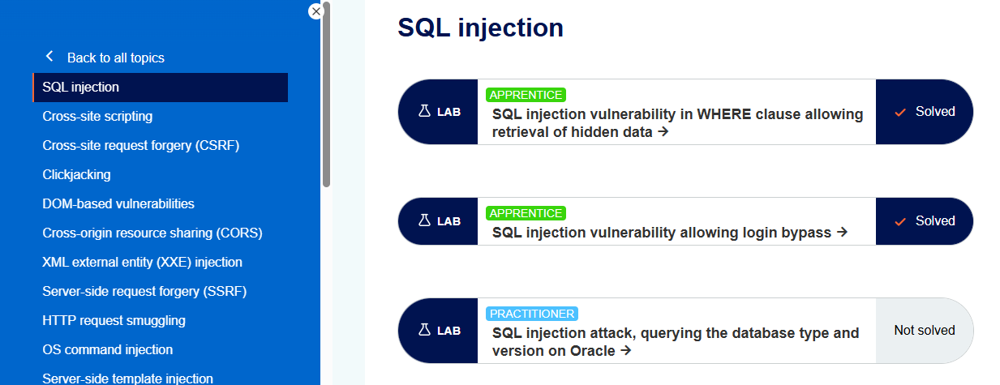
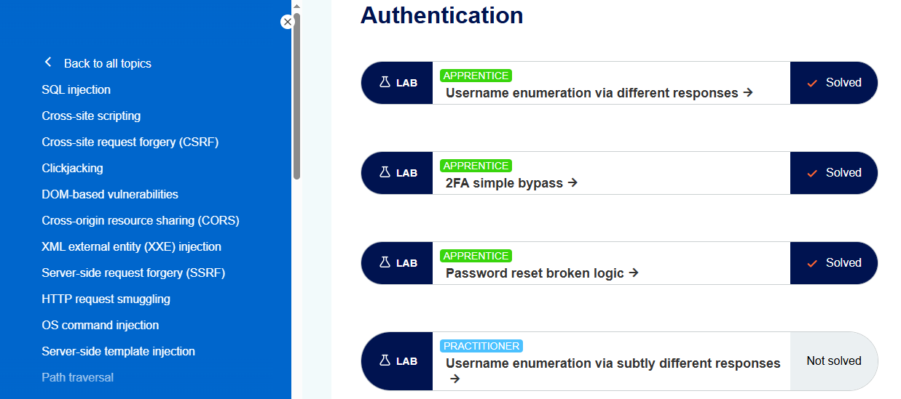
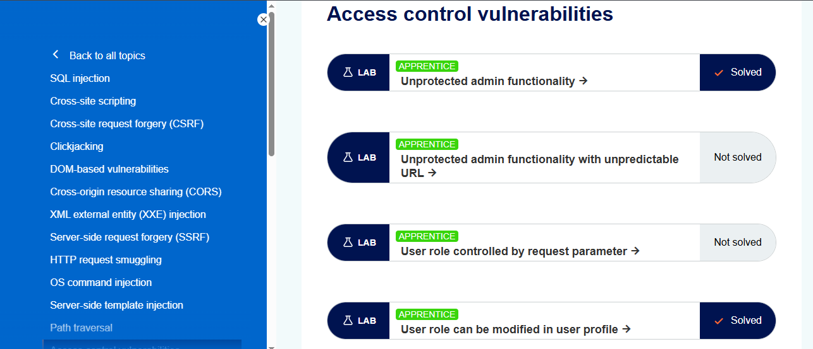

# ✅ Completed Labs – PortSwigger Web Security Academy

---

## 🔐 Topic: SQL Injection

### SQL injection vulnerability in the WHERE clause, allowing the  retrieval of hidden data

**Reflection:**  
In this lab, I learned how SQL injection vulnerabilities occur when user input is directly used in SQL queries without proper validation. By manipulating the category parameter in the URL, I was able to retrieve hidden products from the database. The most challenging part was understanding how the backend SQL query was structured and how logical conditions like `OR 1=1` affect query execution. This lab helped me understand how attackers can bypass application logic using simple SQL payloads.

---

### SQL injection vulnerability allowing login bypass

**Reflection:**  
This lab demonstrated how SQL injection can be used to bypass authentication mechanisms. I learned that when login credentials are not properly sanitized, an attacker can manipulate the SQL query to log in without knowing a valid password. The challenging part was identifying the correct payload that would always evaluate to true while commenting out the rest of the query. This lab reinforced the importance of secure input handling and prepared me to recognize authentication-related SQL injection flaws.

---

## 🔑 Topic: Authentication

### Username enumeration via different responses

**Reflection:**  
In this lab, I learned how different error messages during login can leak information about valid usernames. By using Burp Suite Intruder, I was able to identify a valid username based on differences in server responses and then brute-force the password. The most challenging part was analyzing the response length and understanding which response indicated a valid username. This lab highlighted how small response differences can lead to serious authentication vulnerabilities.

---

### Password reset broken logic

**Reflection:**  
This lab helped me understand how insecure password reset logic can be exploited if reset tokens are not properly validated. I observed that the application allowed password changes even when the reset token was missing or invalid. The most challenging part was identifying the correct request in Burp and modifying it to reset another user’s password. This lab emphasized the importance of securely implementing password recovery mechanisms and validating all security tokens on the server side.

---

### 2FA simple bypass

**Reflection:** 

In this lab, I learned how two-factor authentication can be bypassed if it is not properly enforced on sensitive endpoints. Although the application prompted for a verification code, it did not verify access when directly navigating to the account page. By manually changing the URL to /my-account, I was able to access the victim’s account without completing the 2FA step. The most challenging part was understanding the authentication flow and identifying where the security check was missing. This lab highlighted the importance of enforcing authorization checks on every protected page.

---

## 🚪 Topic: Access Control

### Unprotected admin functionality

**Reflection:**  
In this lab, I learned how sensitive admin functionality can be exposed if proper access control checks are missing. By directly accessing the `/admin` endpoint, I was able to reach the admin panel without having administrative privileges. The challenging part was discovering the hidden admin path and confirming that it was not protected. This lab showed how relying on obscurity instead of proper authorization checks can lead to serious security issues.

---

### User role can be modified in the user profile

**Reflection:**  
This lab demonstrated how client-controlled data can lead to privilege escalation. I learned that by modifying the role ID in a JSON request, I could change my user role from a normal user to an admin. The most challenging part was identifying where the role information was exposed in the request and safely modifying it using Burp Repeater. This lab reinforced the importance of enforcing access control rules on the server side rather than trusting user input.

---

